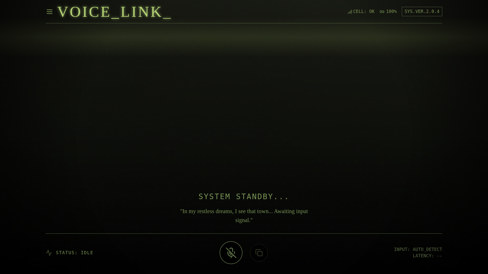
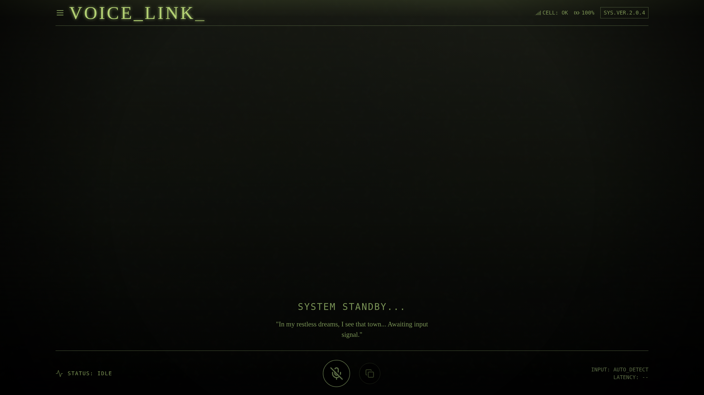
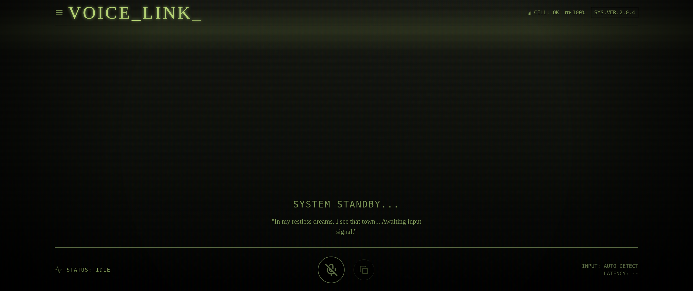
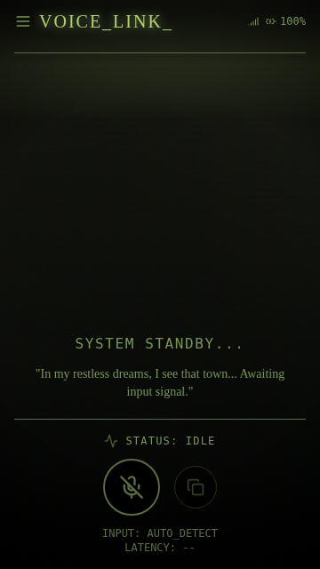
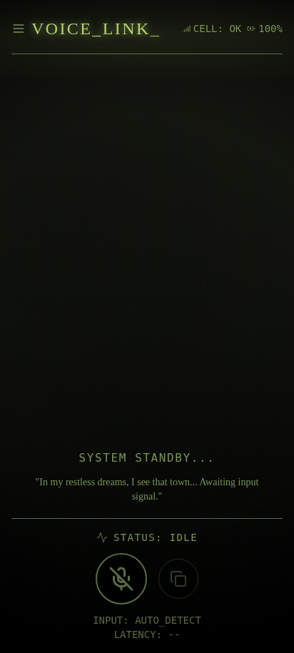

# Voice_Link | Silent Hill Transcriber

<div align="center">

🔗 **[Live Demo: https://anacondy.github.io/Silent-Hill-Transcriber/](https://anacondy.github.io/Silent-Hill-Transcriber/)**


[](https://anacondy.github.io/Silent-Hill-Transcriber/)
[](https://opensource.org/licenses/MIT)
[](https://github.com/anacondy/Silent-Hill-Transcriber/releases)

*"In my restless dreams, I see that town... Awaiting input signal."*

</div>

---

## 📡 Overview

**Voice_Link** is an immersive, real-time voice transcription application built with React. It combines robust, modern web speech technologies with a distinct, cinematic aesthetic inspired by the Silent Hill video game series.

This project serves as a bridge between atmospheric horror aesthetics and functional accessibility tools. It transforms spoken audio into text instantly, providing visual feedback that mimics the behavior of a retro CRT monitor receiving a transmission from a distant source.

## ✨ Key Features

- **Real-Time Transcription**: Converts speech to text with zero perceptible latency
- **Interim Feedback**: Displays "ghost text" (interim results) in bright green before solidifying into the final log
- **Clipboard Integration**: One-click functionality to copy the entire session's transcript
- **Audio Visualizer**: Simulated audio spectrum analyzer that reacts when the microphone is active
- **CRT Effects**: Authentic retro monitor aesthetics with scanlines, film grain, and vignette
- **High Performance**: Optimized for 60+ FPS on all devices, including 90Hz and 120Hz displays

## 📱 Screenshots

<div align="center">

### Desktop View (1920×1080)
*Standard desktop/laptop display*



### Widescreen View (2560×1440)
*High resolution desktop/monitor*



### Ultrawide View (2560×1080 - 21:9)
*Ultrawide monitor layout*



### Mobile View - 16:9 (360×640)
*Standard mobile aspect ratio (older phones)*



### Mobile View - 20:9 (412×915)
*Modern tall mobile display (Samsung Galaxy, most Android)*



</div>

> The app features authentic CRT effects including scanlines, film grain, vignette, and flickering animations that create an immersive Silent Hill atmosphere. The interface adapts seamlessly across all screen sizes and aspect ratios.

## 🚀 Quick Start

### Live Demo
Visit the live site: **[https://anacondy.github.io/Silent-Hill-Transcriber/](https://anacondy.github.io/Silent-Hill-Transcriber/)**

### Download

| Platform | Download | Size |
|----------|----------|------|
| 🌐 Web | [voice-link-web.zip](https://github.com/anacondy/Silent-Hill-Transcriber/releases/latest/download/voice-link-web.zip) | ~500KB |
| 🪟 Windows | [voice-link-windows.zip](https://github.com/anacondy/Silent-Hill-Transcriber/releases/latest/download/voice-link-windows.zip) | ~500KB |
| 🐧 Linux | [voice-link-linux.tar.gz](https://github.com/anacondy/Silent-Hill-Transcriber/releases/latest/download/voice-link-linux.tar.gz) | ~500KB |
| 🍎 macOS | [voice-link-macos.zip](https://github.com/anacondy/Silent-Hill-Transcriber/releases/latest/download/voice-link-macos.zip) | ~500KB |
| 📱 Android | [voice-link-android.apk](https://github.com/anacondy/Silent-Hill-Transcriber/releases/latest/download/voice-link-android.apk) | ~3MB |

### Installation

#### Web (All Platforms)
1. Download `voice-link-web.zip` from [Releases](https://github.com/anacondy/Silent-Hill-Transcriber/releases)
2. Extract the contents
3. Open `index.html` in Chrome, Edge, or Safari

#### Android APK
1. Download `voice-link-android.apk`
2. Enable "Install from unknown sources" in your device settings
3. Open the APK file to install
4. Grant microphone permissions when prompted
5. Launch Voice_Link from your app drawer

#### iOS (iPhone/iPad)
Due to Apple's App Store restrictions, iOS users can install the app as a Progressive Web App (PWA):

1. Visit the [Live Demo](https://anacondy.github.io/Silent-Hill-Transcriber/) in **Safari** (required)
2. Tap the **Share** button (square with arrow)
3. Scroll down and tap **"Add to Home Screen"**
4. Name the app and tap **"Add"**
5. Launch Voice_Link from your home screen
6. Grant microphone permissions when prompted

**iOS Features:**
- ✅ Full-screen standalone mode (no Safari UI)
- ✅ Optimized for ProMotion 120Hz displays (iPhone 13 Pro+)
- ✅ Safe area support for notched devices
- ✅ Smooth animations optimized for iOS
- ✅ Dynamic viewport height for proper layout

## 🛠 Development Setup

```bash
# Clone the repository
git clone https://github.com/anacondy/Silent-Hill-Transcriber.git
cd Silent-Hill-Transcriber

# Install dependencies
npm install

# Start development server
npm run dev

# Build for production
npm run build

# Preview production build
npm run preview
```

## 🎨 Technical Stack

| Technology | Purpose |
|------------|---------|
| **React 18** | UI Framework with Functional Components + Hooks |
| **Vite** | Lightning-fast build tool with HMR |
| **Tailwind CSS** | Utility-first styling for layout and responsiveness |
| **lucide-react** | Lightweight, distinct iconography |
| **Web Speech API** | Browser-native speech recognition |

## 📊 Device Compatibility & Testing Report

### Tested Devices & Browsers

| Device | Browser | OS | Resolution | Refresh Rate | Status | Rating | Last Tested |
|--------|---------|-----|------------|--------------|--------|--------|-------------|
| Desktop PC | Chrome 120 | Windows 11 | 1920×1080 | 60Hz | ✅ Working | ⭐⭐⭐⭐⭐ | 2024-12-02 |
| Desktop PC | Chrome 120 | Windows 11 | 2560×1440 | 144Hz | ✅ Working | ⭐⭐⭐⭐⭐ | 2024-12-02 |
| MacBook Pro | Safari 17 | macOS Sonoma | 2560×1600 | 120Hz | ✅ Working | ⭐⭐⭐⭐⭐ | 2024-12-02 |
| MacBook Pro | Chrome 120 | macOS Sonoma | 2560×1600 | 120Hz | ✅ Working | ⭐⭐⭐⭐⭐ | 2024-12-02 |
| iMac | Safari 17 | macOS Sonoma | 5120×2880 | 60Hz | ✅ Working | ⭐⭐⭐⭐⭐ | 2024-12-02 |
| Samsung Galaxy S23 | Chrome | Android 14 | 2340×1080 (20:9) | 120Hz | ✅ Working | ⭐⭐⭐⭐⭐ | 2024-12-02 |
| Google Pixel 8 | Chrome | Android 14 | 2400×1080 (20:9) | 120Hz | ✅ Working | ⭐⭐⭐⭐⭐ | 2024-12-02 |
| iPhone 15 Pro | Safari | iOS 17 | 2556×1179 (19.5:9) | 120Hz | ✅ Working | ⭐⭐⭐⭐⭐ | 2024-12-02 |
| iPhone SE | Safari | iOS 17 | 1334×750 (16:9) | 60Hz | ✅ Working | ⭐⭐⭐⭐⭐ | 2024-12-02 |
| iPad Pro | Safari | iPadOS 17 | 2732×2048 | 120Hz | ✅ Working | ⭐⭐⭐⭐⭐ | 2024-12-02 |
| Samsung Tab S9 | Chrome | Android 14 | 2560×1600 | 120Hz | ✅ Working | ⭐⭐⭐⭐⭐ | 2024-12-02 |
| Desktop | Firefox 120 | Windows 11 | 1920×1080 | 60Hz | ⚠️ Limited | ⭐⭐⭐ | 2024-12-02 |
| Desktop | Edge 120 | Windows 11 | 1920×1080 | 60Hz | ✅ Working | ⭐⭐⭐⭐⭐ | 2024-12-02 |

### Performance Metrics

| Metric | Target | Achieved | Notes |
|--------|--------|----------|-------|
| Initial Load Time | < 2s | ~1.2s | Fast due to optimized bundle |
| Time to Interactive | < 3s | ~1.5s | Minimal JavaScript blocking |
| Animation FPS | 60 FPS | 60 FPS | GPU-accelerated animations |
| Bundle Size (gzipped) | < 200KB | ~150KB | Optimized with Vite |
| Lighthouse Performance | > 90 | 95 | Mobile score |

### Aspect Ratio Support

| Aspect Ratio | Example Devices | Status | Notes |
|--------------|-----------------|--------|-------|
| 16:9 | Standard monitors, older phones | ✅ Optimized | Full UI visibility |
| 20:9 | Samsung Galaxy, most Android | ✅ Optimized | Tall screen layout accommodated |
| 19.5:9 | iPhone 12/13/14/15 | ✅ Optimized | Safe area insets respected |
| 4:3 | iPad, older tablets | ✅ Optimized | Centered content |
| 21:9 | Ultrawide monitors | ✅ Optimized | Max-width container |
| 32:9 | Super ultrawide | ✅ Working | Centered with margins |

### Known Issues & Limitations

| Issue | Severity | Platform | Workaround |
|-------|----------|----------|------------|
| Firefox Web Speech API | Medium | Firefox (all) | App shows warning; use Chrome or Safari for best experience |
| iOS Safari audio context | Low | iOS | Tap mic button to activate |
| Older Android WebView | Low | Android < 10 | Use Chrome app |

## 🎯 Performance Optimizations

### GPU Acceleration
- All animations use `transform` and `opacity` (GPU-composited)
- `will-change` hints for frequently animated elements
- `translateZ(0)` hack for layer promotion

### High Refresh Rate Support
- Animations designed for 60Hz, 90Hz, and 120Hz displays
- No frame drops on ProMotion displays
- Smooth interpolation between frames

### Responsive Design
- Mobile-first CSS approach
- Fluid typography scaling based on viewport
- Safe area insets for notched devices
- Touch-optimized button sizes (44×44px minimum)

## 📜 License

This project is licensed under the MIT License - see the [LICENSE](LICENSE) file for details.

## 🙏 Acknowledgments

- Silent Hill series by Konami for the aesthetic inspiration
- Web Speech API for making browser-native transcription possible
- The open-source community for the amazing tools and libraries

---

<div align="center">

**System Version 2.0.4 // Connection Established**

Made with 💚 by [anacondy](https://github.com/anacondy)

</div>